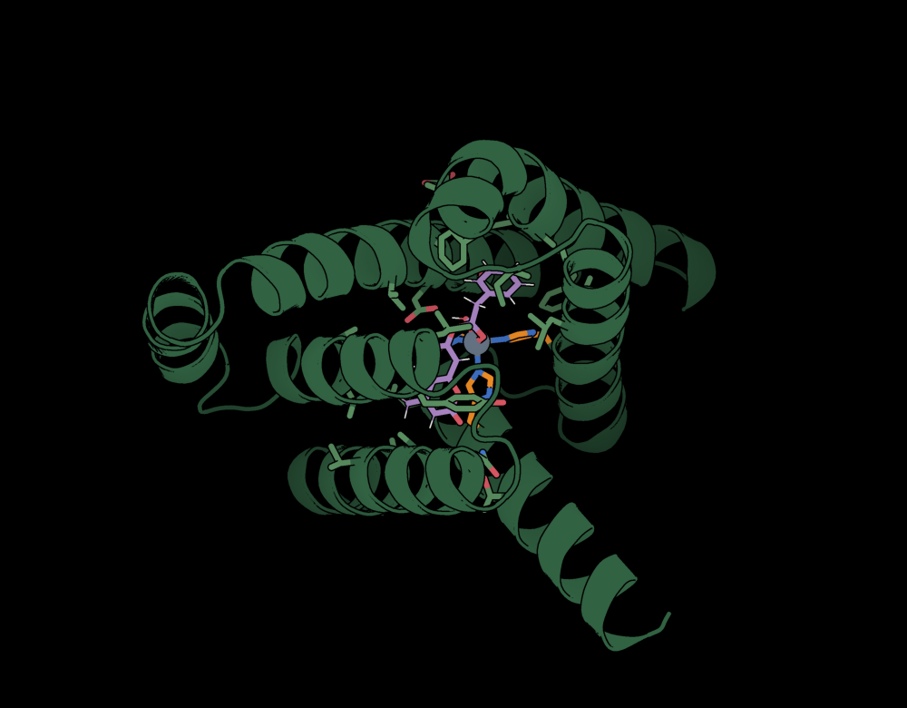

# pymolrc

My PyMOL startup config (`.pymolrc`): a foliage-green color scheme plus performance
fixes and custom commands for browsing protein-design outputs.



## Install

```bash
cp .pymolrc ~/.pymolrc        # back up any existing ~/.pymolrc first
# or symlink:  ln -s "$PWD/.pymolrc" ~/.pymolrc
```

The bundled `show_termini.py` sits next to `.pymolrc` and loads automatically.

## Features

- **Foliage color scheme**, applied per object on load: greens for protein, amethyst
  ligands, soft element colors, black background.
- **Metals as spheres**, detected by element, residue name, or atom name — including
  metals buried inside a ligand residue.
- **Catalytic residues** highlighted from `REMARK 666` (sidechain sticks; whole residue
  for PRO/GLY).
- **Fast batch browsing**: load a glob of designs and page through them with pgup/pgdn.
  `autosolo` loads extras hidden for near-instant startup on large sets.
- **Structural align-all**, background toggle, one-line sequence dump, and residue-gradient
  coloring.

## Commands

| Command | Description |
|---|---|
| `seq [sel]` | print the one-letter sequence of a selection |
| `show_metals [sel]` | show metals as spheres |
| `show_catres [sel]` · `only_catres` | catalytic-residue sticks |
| `style_all [sel]` | (re)apply the full style |
| `color_palette [sel]` | apply the foliage look |
| `bg_white` · `bg_black` | background toggle |
| `align_all [ref]` · `center_all [ref]` | superpose / co-center all objects |
| `autostyle` · `autoalign` · `autosolo` `on\|off` | load-time behavior toggles |
| `publication_ray_trace` | ray-traced figure render |
| `color_bb_rfdiffusion [sel]` | RFdiffusion gradient (dark blue → navaho), N→C |
| `color_bb_rfdiffusion3 [sel]` | RFdiffusion3 gradient (pink → purple → teal → dark blue), N→C |
| `gaussian_mode [sel]` · `gaussian_off [sel]` | GaussView / QM look (glossy ball-and-stick, bond orders, perspective), and restore |
| `gaussian_spin` `on\|off` | gentle continuous spin (GUI) |
| `rfd3_movie <traj.cif.gz>` | RFdiffusion3 diffusion movie from one trajectory file: diffusing protein as CA spheres + sidechain V-cloud colored by the RFd3 gradient; fixed motif/cofactor/Zn auto-detected and shown in your normal style; then `mplay` |

The `color_bb_*` commands default to `chain A` and recolor carbons only (non-carbon atoms
left alone); pass `all_atom=1` to recolor every atom, or `backbone_only=1` to keep
sidechains as they are.

## Examples

`example_pdbs/` holds sample structures to try the commands on:
- `ZETA_1__A1_metalloesterase_theozyme.pdb` — a metalloesterase theozyme (Zn + His triad + substrate); good for `gaussian_mode` and `color_bb_*`.
- `ZAPP_p1D1_i14_rfd3_noisy_trajectory.cif.gz` — an RFdiffusion3 diffusion trajectory for `rfd3_movie`.

## Reverting

The original pre-fix config is kept locally (git-ignored) as
`pymolrc_backup_2026-06-12.pymolrc`. Restore it with:

```bash
cp ~/pymolrc/pymolrc_backup_2026-06-12.pymolrc ~/.pymolrc
```
